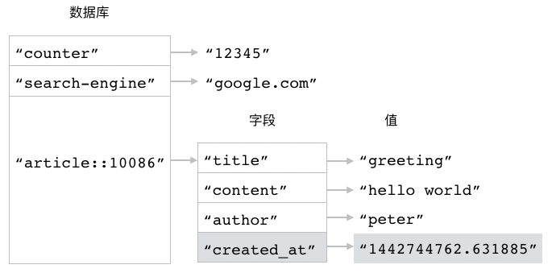
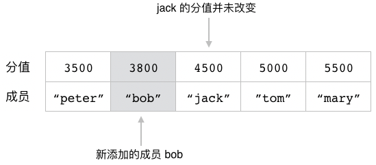
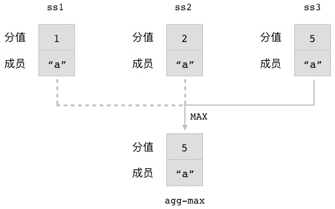
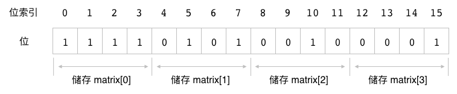
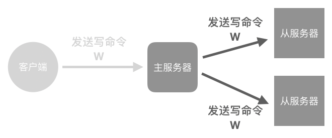

# 第 1 次印刷勘误信息


## 52 页

图 3-3 最后一幅子图，在 ``title`` 和 ``content`` 两个字段之间缺少了分割线，以下是正确的代码：




## 74 页

代码清单 3-5  ``Graph`` 类开头几个方法的缩进有误，以下是正确的代码：

```python
class Graph:

    def __init__(self, client, key):
        self.client = client
        self.key = key

    def add_edge(self, start, end, weight):
        """
        添加一条从顶点 start 连接至顶点 end 的边，并将边的权重设置为 weight 。
        """
        edge = make_edge_name_from_vertexs(start, end)
        self.client.hset(self.key, edge, weight)

    def remove_edge(self, start, end):
        """
        移除从顶点 start 连接至顶点 end 的一条边。
        这个方法在成功删除边时返回 True ，
        因为边不存在而导致删除失败时返回 False 。
        """
        edge = make_edge_name_from_vertexs(start, end)
        return self.client.hdel(self.key, edge)

    def get_edge_weight(self, start, end):
        """
        获取从顶点 start 连接至顶点 end 的边的权重，
        如果给定的边不存在，那么返回 None 。
        """
        edge = make_edge_name_from_vertexs(start, end)
        return self.client.hget(self.key, edge)
```


## 136 页

``is_following`` 方法的第一行有换行错误，以下是正确的代码：

```python
def is_following(self, target):
    """
    检查当前用户是否正在关注目标用户，
    是的话返回 True ，否则返回 False 。
    """
    # 如果 target 存在于当前用户的正在关注集合中
    # 那么说明当前用户正在关注 target
    user_following_set = following_key(self.user)
    return self.client.sismember(user_following_set, target)
```


## 155 页

图 6-6 下方的描述“新添加的成中 bob”应改为“新添加的**成员** bob”，以下是正确的图片：




## 168 页

图 6-19 多了一条范围线，以下是正确的图片：


## 179 页

图 6-30 中，``MAX`` 旁边的连接线应为实线，以下是正确的图片：




## 208 页

原文：

> 使用这个程序去记录 100 万个用户的信息只需要耗费 125KB 内存，而记录 1000 万个用户的信息也只需要 1.25MB 内存。

应改为：

> 使用这个程序去记录 100 万个用户的信息只需要耗费**大约 122KB** 内存，而记录 1000 万个用户的信息也只需要**大约 1.2MB** 内存。


## 212 页

图 8-12 上方的第一个位索引应为 ``0`` 而不是 ``1`` ，以下是正确的图片：




## 213 页

代码清单 8-2 的 ``calculate_index()`` 函数最后一句，原文：

>  ``row*row_num+col``

应改为：

>  ``row*col_num+col``

以下是完整的函数代码：

```python
def calculate_index(row, col, row_num, col_num):
    if not (row < row_num):
        raise ValueError("row out of range")
    if not (col < col_num):
        raise ValueError("col out of range")
    return row*col_num+col
```


## 445 页

图 18-5 下方的第二个子图中，“发送写命令 W”下面的线应为灰色，以下是正确的图片：


